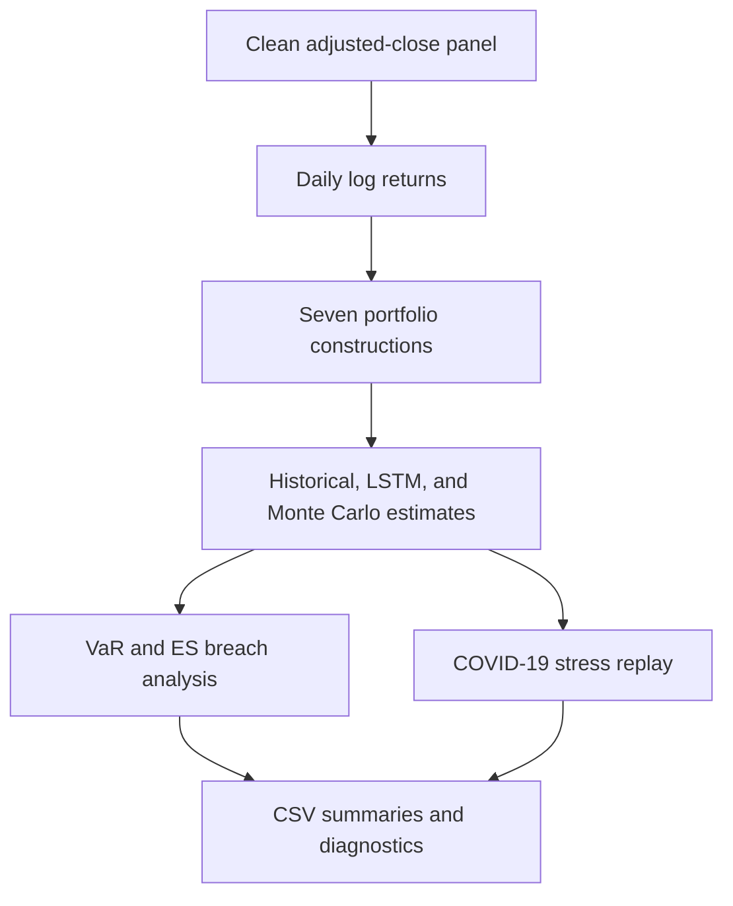

# LSTM VaR — comparing tail-risk estimators

An empirical comparison of historical, Monte Carlo, and LSTM-based Value-at-Risk
(VaR) and Expected Shortfall (ES) across seven equity portfolios.

This was developed as a Georgia Tech ISYE 6740 course project. The repository keeps
the code, dated input snapshot, full saved outputs, visual diagnostics, and final
report together so the experiment can be inspected end to end.


## Research question

Can a sequence model that predicts both conditional mean and volatility provide a
useful daily tail-risk estimate relative to two familiar baselines?

The project evaluates:

1. **Historical simulation** — empirical 5th-percentile return and mean loss beyond
   that threshold.
2. **LSTM distribution forecast** — a two-layer recurrent model predicts conditional
   mean and positive volatility; 1,000 return scenarios produce VaR and ES.
3. **Parametric Monte Carlo** — 1,000 correlated asset-return scenarios are sampled
   from rolling mean and covariance estimates.

The same methods are applied to an equal-weight portfolio, a capitalization-weight
portfolio, and five long-only portfolios derived from absolute principal-component
loadings.

## Experimental design

| Setting | Saved experiment |
| --- | --- |
| Asset universe | 435 constituents in the cleaned price panel |
| Input period | 25 Nov 2009 to 19 Nov 2024 |
| Price observations | 3,771 trading days |
| Risk level | 95% one-day VaR and ES |
| Estimation history | 1,008 trading days for the main rolling analysis |
| LSTM input | 252 daily returns; 100 hidden units; 2 layers |
| Simulation size | 1,000 scenarios per portfolio-date-method |
| Evaluation snapshot | 126 aligned observations, 22 May to 19 Nov 2024 |
| Stress window | 18 Feb to 20 Mar 2020, with surrounding context |

The 126-observation evaluation length is the configured 378-day holdout minus the
252-day sequence required before the LSTM can issue its first aligned forecast.

## Saved result snapshot

The table below summarizes VaR breach-rate ranges across all seven saved portfolios.
For a correctly calibrated 95% VaR model, the long-run target is approximately 5%.
A lower number is not automatically better: it can also indicate an overly
conservative estimate.

| Method | May–Nov 2024 | COVID-19 stress window |
| --- | ---: | ---: |
| Historical | 0.79%–3.97% | 50.00%–58.33% |
| LSTM | 0.79%–4.76% | 16.67%–45.83% |
| Monte Carlo | 2.38%–7.14% | 50.00%–54.17% |

The normal-period snapshot shows broadly plausible coverage for several portfolios,
but the stress results make the central lesson clearer: calibration can deteriorate
abruptly under a regime shift. These ranges are descriptive results from this dated
experiment, not evidence that one estimator is universally superior.

Explore the supporting artifacts:

- [Final project report](rseet3_final_project_report_group_165.pdf)
- [Portfolio-level CSV summaries](results/)
- [PCA diagnostics](results/pca_analysis/)
- [COVID-19 stress outputs](results/covid_analysis/)
- [All generated plots](results/plots/)

## Model and evaluation flow



The LSTM has separate heads for conditional mean and volatility. Its training loss
combines a heavy-tailed likelihood with skewness, kurtosis, volatility, and breach-
rate penalties. Early stopping, gradient clipping, learning-rate reduction, and a
fixed random seed support stable training.

## Run the experiment

Python 3.11 is recommended.

```bash
git clone https://github.com/ignitesplash101/LSTM_VaR_project.git
cd LSTM_VaR_project
python -m venv .venv
source .venv/bin/activate
python -m pip install -r requirements.txt
python main.py
```

The committed snapshot under `data/data/` is sufficient to reproduce the analysis
without downloading new market data. A full run trains seven models and can take a
while on CPU. Compatible acceleration is used automatically when available.

To build a new dated input snapshot instead:

```bash
python data/data_extraction.py
python main.py
```

Refreshing the data changes the constituent set, market-cap weights, dates, and
therefore the results. Treat it as a new experiment rather than a reproduction of
the committed output.

## Repository map

| Path | Purpose |
| --- | --- |
| `main.py` | Orchestrates portfolio construction, estimation, evaluation, and exports |
| `models_lstm.py` | Mean/volatility LSTM architecture |
| `training.py` | Custom loss, optimization, early stopping, and checkpoint selection |
| `risk_metrics.py` | Historical, LSTM-scenario, and Monte Carlo VaR/ES calculations |
| `portfolio_analysis.py` | Rolling analysis and stress-period evaluation |
| `data_processing.py` | Sequence creation, portfolio weights, and scenario generation |
| `data/data_extraction.py` | Optional input refresh pipeline |
| `pca_analysis.py` | Portfolio-composition and PCA diagnostics |
| `results/` | Saved metrics, stress outputs, and plots |

## Important limitations

This repository preserves a course-research snapshot, including its methodological
limitations:

- The evaluation has only 126 aligned observations. Tail-coverage comparisons are
  therefore noisy and should not be treated as conclusive model rankings.
- The scaler and PCA portfolio loadings are fitted on the full saved sample, and the
  historical-VaR helper includes the current observation in its rolling window.
  Those choices introduce look-ahead leakage, so the outputs are exploratory rather
  than a strict out-of-sample backtest.
- Portfolio weights are static. The capitalization-weight portfolio uses one saved
  market-cap snapshot rather than point-in-time constituents and weights.
- The parametric simulation estimates an unregularized 435-asset covariance matrix
  from at most 252 daily observations and assumes recent moments describe the next
  day's joint return distribution.
- The stress exercise demonstrates behavior over one exceptional regime; it is not
  a complete validation across market cycles.
- Transaction costs, liquidity, position constraints, and portfolio rebalancing are
  outside the scope of the experiment.

The project is educational research, not investment advice or a production risk
model.
